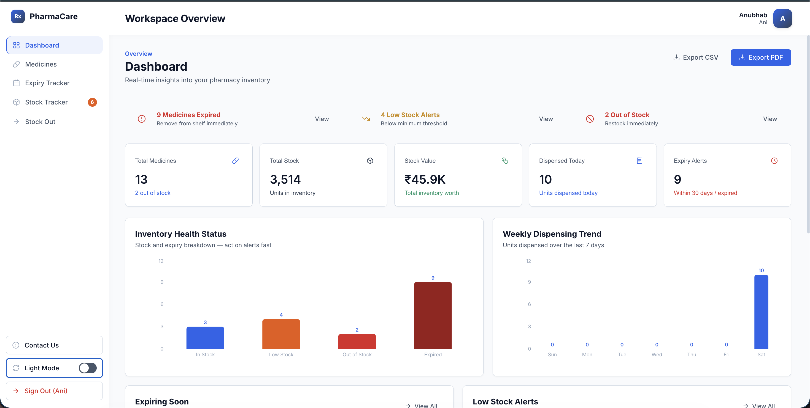
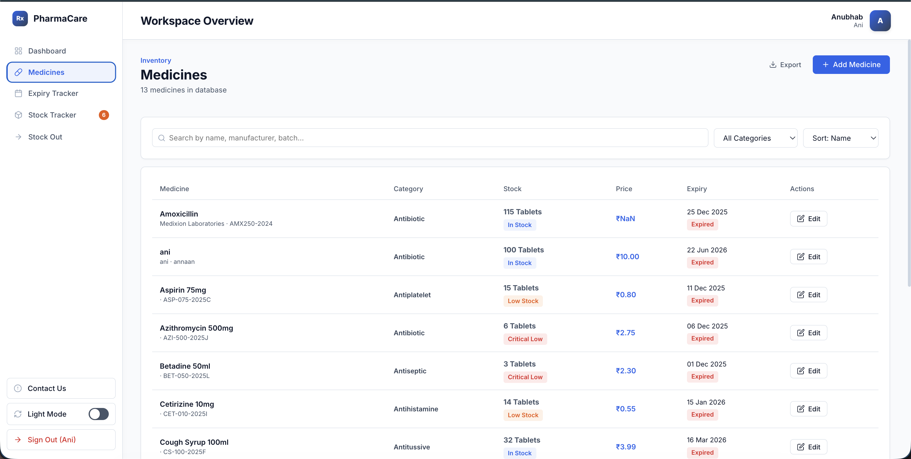
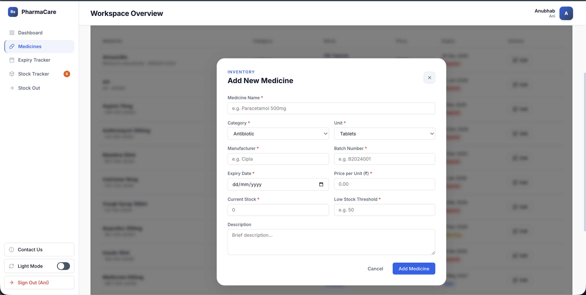
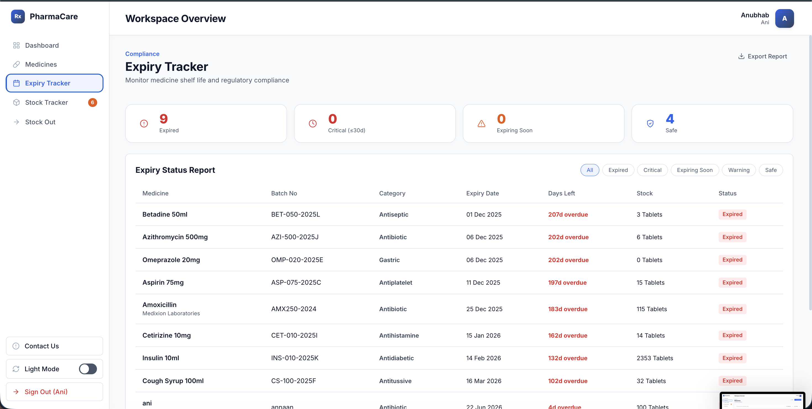
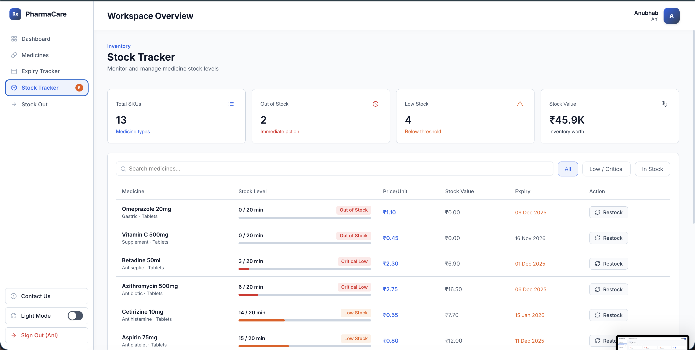
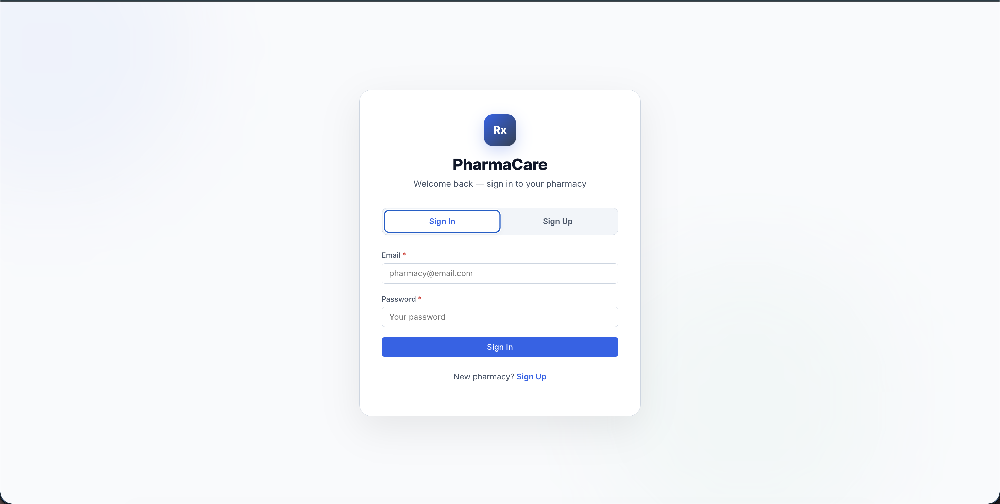
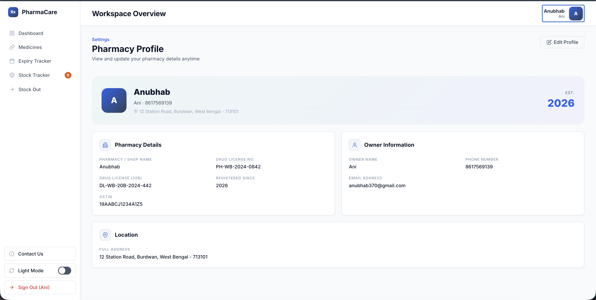

# 💊 PharmaCare - Pharmacy Inventory & Stock Management System

## 📸 Application Screenshots

| Dashboard | Medicines |
|-----------|-----------|
|  |  |

| Add Medicine | Expiry Tracker |
|--------------|----------------|
|  |  |

| Stock Tracker | Login |
|---------------|-------|
|  |  |

A modern **Full-Stack Pharmacy Inventory Management System** built using the **MERN Stack (MongoDB, Express.js, React.js, Node.js)**.

PharmaCare helps pharmacies efficiently manage medicine inventory, monitor stock levels, track expiry dates, and maintain complete pharmacy records through an intuitive and responsive web application.


---

# 🚀 Live Features

- 💊 Complete Medicine Inventory Management
- 📊 Interactive Dashboard
- 📦 Stock Management
- 📅 Expiry Tracking
- 🔍 Advanced Search & Filtering
- 📈 Charts & Analytics
- 🔐 Authentication
- 👤 Pharmacy Profile
- 📱 Fully Responsive Design
- 🌙 Modern UI

---

# 📸 Application Screenshots

## Login Page


---

## Dashboard


---

## Medicines Management


---

## Add Medicine


---

## Expiry Tracker


---

## Stock Tracker


---

## Pharmacy Profile



---

# ✨ Features

## 📊 Dashboard

- Total Medicines
- Total Stock
- Low Stock Summary
- Expiring Medicines Summary
- Interactive Charts
- Quick Navigation Cards

---

## 💊 Medicines

- Add Medicine
- Edit Medicine
- Delete Medicine
- Search Medicines
- Filter by Category
- Sort Medicines
- Pagination

---

## 📦 Stock Tracker

- Out of Stock Detection
- Critical Stock Alert
- Low Stock Alert
- Stock Status Badges

---

## 📅 Expiry Tracker

- Expired Medicines
- Expiring within 30 Days
- Expiring within 90 Days
- Remaining Days Counter
- Color-coded Status

---

## 👤 Authentication

- Secure Login
- Protected Routes
- Authentication Context
- Session Management

---

## 🏥 Pharmacy Profile

- Pharmacy Information
- Contact Details
- Profile Management

---

# 🛠 Tech Stack

## Frontend

- React.js
- Vite
- React Router DOM
- CSS Modules
- Pure CSS
- Recharts
- React Toastify

## Backend

- Node.js
- Express.js
- MongoDB
- Mongoose
- JWT Authentication

## Development

- Git
- GitHub
- VS Code
- Postman

---

# 📂 Project Structure

```text
Pharmacy_Inventory_Tracking/
│
├── Backend/
│   ├── config/
│   ├── controllers/
│   ├── middleware/
│   ├── models/
│   ├── routes/
│   ├── scripts/
│   ├── utils/
│   └── server.js
│
├── Frontend/
│   ├── src/
│   │   ├── api/
│   │   ├── components/
│   │   ├── context/
│   │   ├── pages/
│   │   ├── styles/
│   │   └── main.jsx
│
├── screenshots/
│
├── docker-compose.yml
└── README.md
```

---

# ⚙ Installation

## Clone Repository

```bash
git clone https://github.com/anubhab0709/Pharmacy_Inventory_Tracking.git

cd Pharmacy_Inventory_Tracking
```

---

# Backend Setup

```bash
cd Backend

npm install
```

Create a `.env` file using `.env.example`

Example

```env
PORT=4000
MONGO_URL=mongodb://localhost:27017/pharmacy_db
JWT_SECRET=your_secret_key
```

Run backend

```bash
npm run dev
```

Server

```
http://localhost:4000
```

Health Check

```
http://localhost:4000/health
```

---

# Frontend Setup

```bash
cd Frontend

npm install
```

Create

```
.env.local
```

Example

```env
VITE_API_URL=http://localhost:4000/api
```

Run

```bash
npm run dev
```

Frontend

```
http://localhost:5173
```

---

# REST API

## Medicines

```
GET     /api/medicines
GET     /api/medicines/:id
POST    /api/medicines
PUT     /api/medicines/:id
DELETE  /api/medicines/:id
```

## Stock

```
GET /api/medicines/stock/low
```

## Expiry

```
GET /api/medicines/expiry/soon
```

---

# Technologies Used

| Frontend | Backend | Database |
|-----------|----------|-----------|
| React.js | Node.js | MongoDB |
| Vite | Express.js | Mongoose |
| CSS Modules | JWT | |

---

# Future Improvements

- Barcode Scanner
- Supplier Management
- Purchase Management
- Invoice Generation
- Sales Module
- Admin Dashboard
- Reports & Analytics
- PDF Export
- Email Notifications
- Multi-user Roles
- Docker Deployment
- Cloud Deployment

---

# Developer

## 👨‍💻 Anubhab Bhattacharjee

### MERN Stack Developer

**Portfolio**

https://itsanubhab.com/

**GitHub**

https://github.com/anubhab0709

**LinkedIn**

https://www.linkedin.com/in/anubhab0709/

---

# License

This project is licensed under the MIT License.

---

# ⭐ Support

If you found this project useful, please consider giving it a ⭐ on GitHub.

It motivates me to build more open-source projects.